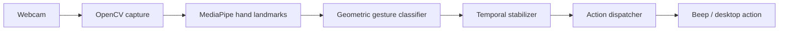
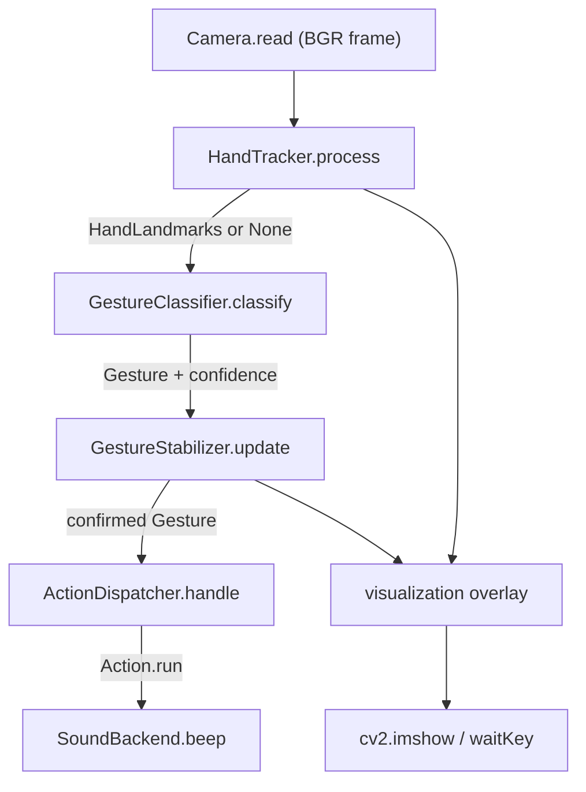

# Vision Gesture Control

Real-time webcam hand-gesture recognition that turns a thumbs-up or thumbs-down
into a desktop action. It uses MediaPipe hand landmarks plus explicit geometry
rather than a trained gesture model, so every decision is readable and unit-testable.

[](https://github.com/Pouya-Mansournia/vision-gesture-control/actions/workflows/tests.yml)
[](https://www.python.org/)
[](LICENSE)

V1 recognizes two gestures, `THUMBS_UP` and `THUMBS_DOWN`, and plays a distinct
beep for each. The project is small on purpose: it exists to show the full
perception pipeline end to end, from webcam frame to confirmed action, in code
you can step through.



## Demo

No screen recording is included yet (`Planned`, see
[Visual assets status](#visual-assets-status)). When the app runs it shows the
live webcam with the hand skeleton drawn on top and a text overlay: raw gesture,
confirmed gesture, FPS, last action, and cooldown state.

## What it does

* Captures webcam frames with OpenCV.
* Extracts 21 hand landmarks per frame with the MediaPipe Tasks `HandLandmarker`.
* Classifies the hand pose into a `Gesture` from landmark geometry: normalized
  distances and directions, not a second neural network.
* Confirms a gesture only after it stays stable for several consecutive frames,
  then applies a cooldown so holding the gesture does not produce a burst of beeps.
* Sends the confirmed gesture to an action. On Windows that is a `winsound` beep;
  on other systems it logs the beep instead of crashing.

## Why geometry instead of a trained model

For V1 the goal is to understand the pipeline, so the classifier is built from
first principles:

* **No dataset, no training, no GPU.** MediaPipe supplies pretrained, real-time
  landmarks. The gesture rules are a handful of geometric comparisons.
* **Deterministic and debuggable.** The same landmarks always produce the same
  gesture, and a rejection is inspectable: thumb not extended, fingers not folded.
* **Resolution independent.** Distances are normalized by the
  wrist-to-middle-finger-MCP length, so the same thresholds hold at any frame
  size or hand distance.

A YOLO-based detector is kept as a later experiment (V4) for an educational
comparison of dataset-based learning against geometric reasoning on accuracy,
FPS, and latency.

## Requirements

* Python 3.9 or newer. Verified on 3.13 with `mediapipe` 1.0, `opencv-python` 5.0,
  `numpy` 2.5.
* A webcam.
* Windows for audible beeps. Other operating systems log the beep instead.
* Internet access on the first run only, to download the hand model (about 7 MB)
  into `models/`. Set `VGC_HAND_MODEL=/path/to/hand_landmarker.task` to use a
  local copy offline.

## Quick start

**Windows:** double-click `run.bat`. It creates `.venv`, installs dependencies,
downloads the model on first use, and launches the app. Double-click
`run-tests.bat` to run only the test suite (no webcam needed).

**Any platform, manually:**

```bash
python -m venv .venv
# Windows:        .venv\Scripts\activate
# macOS / Linux:  source .venv/bin/activate
pip install -r requirements.txt
python -m vision_gesture_control.main
```

Show a normal hand: nothing happens. Show and hold a thumbs-up: after a few
frames it is confirmed and a short high beep fires once. Keep holding it: no
repeat. Switch to thumbs-down: a longer low beep fires once.

### Controls and CLI flags

| Input | Effect |
| --- | --- |
| `Q` or `ESC` | quit; the camera is released and windows close |
| `--camera-index N` | use webcam index `N` (default `0`) |
| `--no-landmarks` | hide the hand skeleton overlay |
| `--log-level DEBUG` | change logging verbosity |

## Supported gestures

| Status | Gesture | Action |
| --- | --- | --- |
| implemented | `THUMBS_UP` | short high-frequency beep (1400 Hz, 120 ms) |
| implemented | `THUMBS_DOWN` | longer low-frequency beep (400 Hz, 350 ms) |
| reserved | `OPEN_PALM`, `FIST`, `INDEX_UP`, `INDEX_DOWN`, `PEACE`, `OK` | none yet |

Adding a gesture means adding a branch in `GestureClassifier.classify` and an
entry in the action map. No other wiring changes.

## How it works

The per-frame path is `Camera.read` → optional mirror → `HandTracker.process` →
`GestureClassifier.classify` → `GestureStabilizer.update` →
`ActionDispatcher.handle`, with `visualization` drawing the skeleton and overlay.

* **Classifier.** A gesture is a thumbs-up when the thumb is extended (its
  tip-to-CMC length over hand scale exceeds a threshold), pointing up (its
  vertical component dominates its horizontal one and the tip sits above the
  wrist), and the other four fingers are folded (each fingertip is closer to the
  wrist than its MCP joint by a set ratio). Thumbs-down is the same test with the
  thumb pointing down.
* **Stabilizer.** It counts the trailing run of identical raw gestures. Once the
  run reaches `gesture_confirmation_frames`, that gesture becomes confirmed. A
  single noisy frame cannot flip a confirmed state; clearing it needs a full run
  of the new value.
* **Dispatcher.** After firing for a gesture it will not fire again until the
  confirmed gesture changes, including returning to `UNKNOWN`. A separate global
  cooldown sets a minimum time between any two fired actions.

Full details, including the ROS 2 boundary and the YOLO comparison, are in
[docs/architecture.md](docs/architecture.md).



## Repository structure

```text
vision-gesture-control/
├── src/vision_gesture_control/
│   ├── landmarks.py           # numpy-only HandLandmarks + hand topology
│   ├── camera.py              # OpenCV VideoCapture wrapper
│   ├── hand_tracker.py        # MediaPipe HandLandmarker -> HandLandmarks
│   ├── gesture_classifier.py  # geometric classification -> Gesture
│   ├── gesture_stabilizer.py  # temporal confirmation over consecutive frames
│   ├── action_dispatcher.py   # Gesture -> Action, hold + cooldown, sound backends
│   ├── visualization.py       # skeleton + status overlay
│   ├── config.py              # every tunable in one dataclass
│   └── main.py                # pipeline wiring, real-time loop, FPS meter
├── tests/                     # pytest suite, no webcam required
├── docs/architecture.md       # data flow, ROS 2 boundary, YOLO comparison
├── models/                    # hand_landmarker.task, downloaded on first run
├── run.bat / run-tests.bat    # Windows launchers
└── requirements.txt
```

`HandLandmarks` sits in its own `landmarks.py`, separate from `hand_tracker.py`,
so the gesture logic and its tests never import OpenCV or MediaPipe. The vision
core (`landmarks`, `gesture_classifier`, `gesture_stabilizer`) has no I/O
dependency, which is what would let it become a ROS 2 node later:
`camera.py` becomes an image subscriber and `action_dispatcher.py` becomes a
command publisher.

## Configuration

Every tunable lives in `AppConfig` in `config.py`.

| Key | Default | Meaning |
| --- | --- | --- |
| `camera.index` / `width` / `height` / `target_fps` | `0` / `1280` / `720` / `30` | capture settings |
| `gesture_confirmation_frames` | `5` | consecutive frames needed to confirm |
| `gesture_window_size` | `12` | rolling history length |
| `action_cooldown_seconds` | `1.0` | minimum time between fired actions |
| `thumb_extension_threshold` | `0.6` | thumb length over hand scale to count as extended |
| `finger_fold_threshold` | `1.1` | `dist(tip, wrist) < k · dist(mcp, wrist)` means folded |
| `thumb_vertical_ratio` | `1.2` | vertical over horizontal thumb direction |
| `thumbs_up` / `thumbs_down` beep freq and duration | 1400 Hz / 120 ms, 400 Hz / 350 ms | beep tones |
| `draw_landmarks` / `show_fps` / `mirror_preview` | `True` | overlay behaviour |

## Tests

```bash
python -m pytest -q
```

16 tests, no webcam. CI runs them on Python 3.9, 3.11, and 3.13. Coverage:

* thumbs-up and thumbs-down recognized from synthetic landmarks, including a
  resolution-scaled hand
* open palm, fist, and a degenerate hand do not trigger
* a single frame never confirms; an alternating up/unknown sequence is rejected
* a stable sequence confirms and survives one noise frame
* an action fires once per hold, cooldown blocks an immediate re-trigger, and
  switching gestures fires the other action

## Assumptions and limitations

* One hand, roughly facing the camera, fingers pointing broadly up or down.
* No in-plane rotation invariance. Heavily rotated or side-on hands read as
  `UNKNOWN`.
* Even lighting; MediaPipe handles detection robustness.
* Only thumbs-up and thumbs-down are implemented. The other enum values are
  placeholders.
* Single hand (`max_hands = 1`).
* Audible beeps are Windows-only. Other platforms log the beep.
* The live webcam loop needs a physical camera and has not been captured here.

## Roadmap

* **V2.** Wrap the recognizer as a ROS 2 node publishing a `/gesture` topic.
* **V3.** Map `/gesture` to real robot commands.
* **V4.** Benchmark landmark geometry against a custom YOLO gesture detector on
  accuracy, FPS, and latency.
* More gestures (open palm, fist, peace, OK) and richer actions (volume,
  play/pause, keyboard shortcuts, custom callbacks).

## Visual assets status

| Asset | Status |
| --- | --- |
| Demo GIF or screen recording | `Planned` |
| Screenshot of the live overlay | `Planned` |
| Social preview image | `Recommended` |
| Logo | Not needed for this project |

## Computer vision concepts demonstrated

Digital images and frames, OpenCV capture and drawing, real-time video, normalized
image coordinates, hand landmarks, geometric reasoning with distances and
directions, rule-based classification, temporal filtering and debouncing, latency
and FPS measurement, and a modular perception architecture with an isolated
detector backend.

## License

MIT. See [LICENSE](LICENSE).

## Author

Pouya Mansournia
