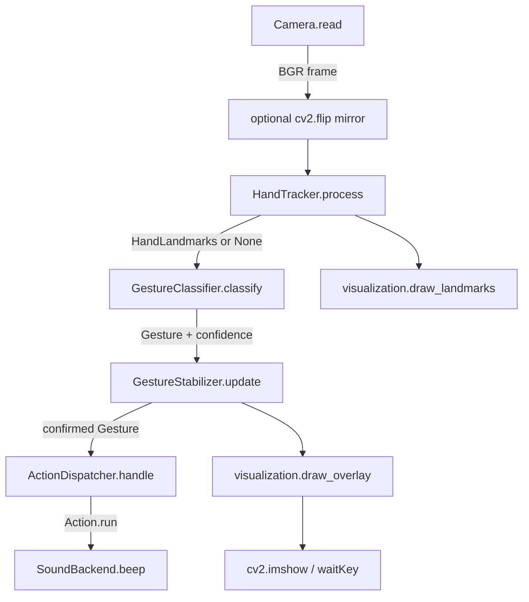

# Architecture

## Data flow

## Module responsibilities

| Module | Depends on | Responsibility |
| --- | --- | --- |
| `landmarks.py` | numpy | Neutral `HandLandmarks` value type + hand topology. No cv2/mediapipe. |
| `camera.py` | opencv | Open / read / release a webcam; context manager; typed errors. |
| `hand_tracker.py` | mediapipe | Run the MediaPipe Tasks `HandLandmarker` (auto-downloads the `.task` model), convert its result to `HandLandmarks`. The **only** place the detector backend is known. |
| `gesture_classifier.py` | numpy | Pure function `HandLandmarks -> Gesture`. Deterministic, unit-tested. |
| `gesture_stabilizer.py` | stdlib | Confirm a gesture only after N consecutive frames; hold through short noise. |
| `action_dispatcher.py` | stdlib | `Gesture -> Action`; fire once per hold; global cooldown; pluggable sound backend. |
| `visualization.py` | opencv | Draw skeleton + status overlay. |
| `config.py` | camera, hand_tracker | One `AppConfig` dataclass with every tunable. |
| `main.py` | all of the above | Wire the pipeline, run the loop, measure FPS, handle exit + cleanup. |

## Boundaries that enable future ROS 2

The "vision core" (`landmarks`, `gesture_classifier`, `gesture_stabilizer`) has
zero dependency on I/O. To make a ROS 2 node:

* **Input:** replace `Camera` with a `sensor_msgs/Image` subscriber that yields
  BGR frames.
* **Output:** replace the beep actions in `ActionDispatcher` with a publisher,
  e.g. `Gesture.THUMBS_UP -> publish Twist / std_msgs`.

`main.py` is the only file that would be rewritten as a node.

## Temporal model

* `GestureStabilizer` keeps a bounded deque of recent raw gestures.
* It counts the **trailing run** of identical values. When the run reaches
  `confirmation_frames`, that value becomes `confirmed`.
* Because only a full run flips the state, a single noisy frame cannot change a
  confirmed gesture; it takes another full run (e.g. `UNKNOWN x N`) to clear it.
* `ActionDispatcher` adds two independent guards:
  * **arming**: after firing for gesture G, it will not fire again until the
    confirmed gesture changes (including back to `UNKNOWN`).
  * **cooldown**: a global minimum wall-clock gap between any two fired actions.

## Performance

* The `HandLandmarker` is created **once** at startup (`HandTracker.open`) and reused.
* `FpsMeter` keeps a 30-sample rolling window of `time.perf_counter` stamps.
* The frame is mirrored in place; landmarks are read without copying the frame.

## Future YOLO experiment (not implemented)

| | Approach A | Approach B |
| --- | --- | --- |
| Method | MediaPipe landmarks + geometric rules | Custom YOLO gesture detector |
| Data | none (pretrained) | labelled dataset: `thumbs_up`, `thumbs_down`, `open_palm`, `fist` |
| Pros | no training, deterministic, explainable | learns appearance, no landmark dependency |
| Cons | rule tuning, limited rotation invariance | dataset collection + training + GPU |

The comparison would measure accuracy, FPS, and end-to-end latency on the same
webcam clips: a concrete lesson in dataset-based learning versus geometric
reasoning.
